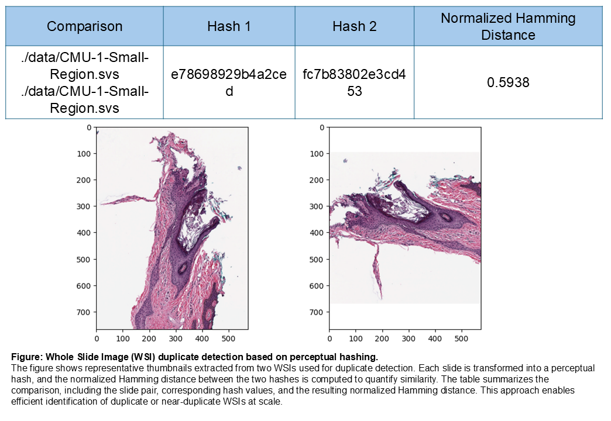

Duplicate Detection
===================

WSI.hashing module
------------------

.. automodule:: WSI.hashing
   :members:
   :undoc-members:
   :show-inheritance:
   :special-members: __init__

About this module
--------------------------------------------------------
This documentation page describes the duplicate-detection workflow used for Whole Slide Images (WSIs).

Duplicate detection compares two WSIs by:
1. Generating perceptual hashes for each slide
2. Computing the **Normalized Hamming Distance** between the hashes

A **lower** normalized Hamming distance indicates higher similarity (possible duplicates),
while a **higher** value indicates greater dissimilarity.

The core API used is:

- ``WSI.hashing.calculate_hamming_distance(first_path, second_path, rotation=..., resizepercentage=...)``

Duplicate Detection Results
--------------------------------------------------------

+---------------------------------------------------------------+------------------+------------------+-------------------------------+
| Comparison                                                    | Hash 1           | Hash 2           | Normalized Hamming Distance   |
+===============================================================+==================+==================+===============================+
| ./data/CMU-1-Small-Region.svs - ./data/CMU-1-Small-Region.svs | e78698929b4a2ced | fc7b83802e3cd453 | 0.5938                        |
+---------------------------------------------------------------+------------------+------------------+-------------------------------+

Figure: Duplicate detection example
--------------------------------------------------------
The figure below shows thumbnails from the two WSIs used for comparison and the
resulting perceptual hashes with the computed normalized Hamming distance.

Loading Required Packages
--------------------------------------------------------

.. code-block:: python

   import os
   import matplotlib.pyplot as plt

   from WSI.readwsi import WSIReader
   from WSI.hashing import calculate_hamming_distance

Compute Normalized Hamming Distance
--------------------------------------------------------
Use ``calculate_hamming_distance`` to compute the normalized Hamming distance between two WSIs.

Parameters commonly used:
- ``rotation``: rotate the thumbnail/representation before hashing (degrees)
- ``resizepercentage``: percent scale used before hashing (e.g., 100, 10, 0.5)

.. code-block:: python

   first_path = "./data/CMU-1-Small-Region.svs"
   second_path = "./data/CMU-1-Small-Region.svs"

   calculate_hamming_distance(first_path, second_path, rotation=0, resizepercentage=10)

Interpreting Results
--------------------------------------------------------
- **Lower normalized distance**  -> slides are more similar (possible duplicates)
- **Higher normalized distance** -> slides are less similar

You can define a duplicate threshold based on your dataset and scanner/staining variation.

Usage Example (Minimal)
--------------------------------------------------------

.. code-block:: python

   from WSI.hashing import calculate_hamming_distance

   first_path = "./data/slide_A.svs"
   second_path = "./data/slide_B.svs"

   calculate_hamming_distance(first_path, second_path, rotation=0, resizepercentage=10)

